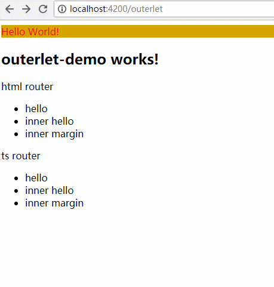

## Named Router简介
支持多个路由同时存在，包括路由中的路由。  
Named Router支持对路由进行命名，从而可以实现在同一个component中可以同时存在多个`router-outlet`进行路由展示

## Names Router的使用

> router配置
```ts
const myRoutes: Route[] = [
  {
    path: "outerlet",
    component: OuterletDemoComponent,
    children: [
      {
        path: "innerHello",
        component: HelloComponent,
        outlet: "inner"
      },
      {
        path: "innerMargin",
        component: MarginAutoDemoComponent,
        outlet: "inner"
      },
    ]
  },
  {
    path: "hello",
    component: HelloComponent
  },
  {
    path: "margin",
    component: MarginAutoDemoComponent
  }
]

...
imports: [
    BrowserModule,
    RouterModule.forRoot(myRoutes, { enableTracing: true })
  ],
```

> OuterletDemoComponent.html   
> 在html中通过routerLink跳转  
```html
<h2>
  outerlet-demo works!
</h2>

<div>
  <span>html router</span>
  <ul>
    <li [routerLink]="['/hello']">hello</li>
    <li [routerLink]="['/outerlet', {outlets: {'inner':['innerHello']}}]">inner hello</li>
    <li [routerLink]="['/outerlet', {outlets: {'inner':['innerMargin']}}]">inner margin</li>
  </ul>
</div>

<div>
  <span>ts router</span>
  <ul>
    <li (click)="gotoHello()">hello</li>
    <li (click)="gotoInnerHello()">inner hello</li>
    <li (click)="gotoInnerMargin()">inner margin</li>
  </ul>
</div>

<router-outlet name="inner"></router-outlet>
```


> OuterletDemoComponent.ts  
> 在ts中使用router路由  
```ts
import { Component, OnInit } from '@angular/core';
import { Router } from '@angular/router';

@Component({
  selector: 'app-outerlet-demo',
  templateUrl: './outerlet-demo.component.html',
  styleUrls: ['./outerlet-demo.component.css']
})
export class OuterletDemoComponent implements OnInit {

  constructor(
    private router: Router
  ) { }

  ngOnInit() {
  }

  gotoHello() {
    this.router.navigateByUrl("/hello");
  }

  gotoInnerHello() {
    this.router.navigateByUrl("/outerlet/(inner:innerHello)");
  }

  gotoInnerMargin() {
    this.router.navigateByUrl("/outerlet/(inner:innerMargin)");
  }
}
```

## 效果


## 个人总结
1. 内部路由，需要在配置路由时，设置为children，且需要设置outlet属性
2. 路由链接(无论是html方式还是ts方式)则需要制定对应的outlet名称


## 参考
- https://stackoverflow.com/a/38038733
- https://onehungrymind.com/named-router-outlets-in-angular-2/
