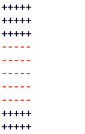
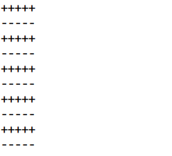

##System.out和System.err的并发

最近在开发时发现，同时使用System.out和System.err打印内容，会出现多线程的现象。

###代码如下：
```java
public class SystemDemo {

    public static void main(String[] args) {

        for (int i = 0; i < 5; i++) {
            System.out.println("+++++");
            // System.out.flush();
            System.err.println("-----");
        }
    }
}
```

运行结果类似于：


###查阅资料的解释是：
1. 标准输出和标准出错的一个区别是，标准输出往往是带缓存的，而标准出错没有缓存。
   但是我们通过添加` System.out.flush`发现，现象依然存在。
   --> 所以不是缓存的原因

2. 另一个解释是，[They are different OutputStreams.](http://stackoverflow.com/questions/15147302/race-between-system-out-and-system-err-in-java)
   建议的方法：

       ```java
       System.setErr(System.out);
       ```
   
    或者

       ```java
       System.setOut(System.err);
       ```
   发现的确是可以的：
    ```java
    private static void test02() {
        System.setErr(System.out);
        // System.setOut(System.err);
        for (int i = 0; i < 5; i++) {
            System.out.println("+++++");
            System.err.println("-----");
        }
    }
    ```
   运行结果：
   

###总结：
   -System.out和System.err使用不同的printstream对象，所以线程不同步。同时使用进行打印，会出现打印内容交叉的结果。
