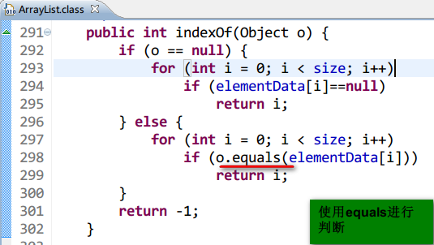
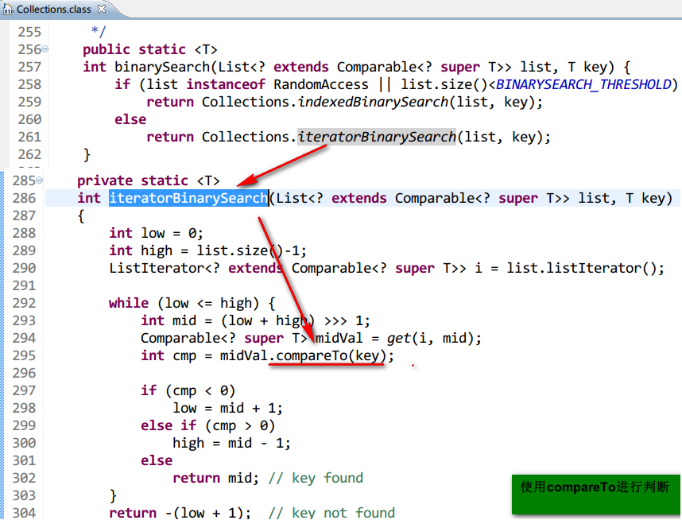

## comparable 和 comparator

### 一、对java对象进行排序

   1. 需要对java对象进行排序，一般使用`Collections.sort(list);`。
   此时对于比较的对象，
    1. 要么实现`Comparable`接口
    2. 在排序时，指定对应的比较器
       ` public static <T> void sort(List<T> list, Comparator<? super T> c)`

   2. 演示如下：
   ```java
   public static void main(String[] args) {
        test01();
    }

    private static void test01() {
        Person p1 = new Person("a", 3);
        Person p2 = new Person("b", 1);
        Person p3 = new Person("c", 4);
        Person p4 = new Person("d", 2);
        Person p5 = new Person("e", 5);

        List<Person> personList = new ArrayList<>();
        personList.add(p3);
        personList.add(p1);
        personList.add(p5);
        personList.add(p2);
        personList.add(p4);

        showPersonInfo(personList);

        // 默认排序
        System.out.println("默认排序");
        Collections.sort(personList);
        showPersonInfo(personList);

        // 自定义排序
        System.out.println("自定义排序");
        Collections.sort(personList, new Comparator<Person>() {

            @Override
            public int compare(Person o1, Person o2) {
                int age1 = o1.getAge();
                int age2 = o2.getAge();
                return age1 - age2;
            }
        });
        showPersonInfo(personList);
    }

    private static void showPersonInfo(List<Person> personList) {
        for (Person person : personList) {
            System.out.println(person);
        }

    }
   ```

#### *`Person.java`*
```java
   public class Person implements Comparable<Person> {
    private String name;

    private int age;

    public Person(String name, int age) {
        this.name = name;
        this.age = age;
    }

    public String getName() {
        return name;
    }

    public int getAge() {
        return age;
    }

    @Override
    public int compareTo(Person o) {
        return this.name.compareTo(o.getName());
    }

    @Override
    public String toString() {
        return "Person [name=" + name + ", age=" + age + "]";
    }

}
```

### 二、在实现comparable接口时，建议也实现equals方法

在实现comparable接口时，实现了compareTo方法，同时也建议实现equals方法。
此时使用findbugs工具扫描，[会要求两个方法在判断上保持一致](http://stackoverflow.com/questions/16701047/bad-practice-class-defines-compareto-and-uses-object-equals)。

摘录：
>
Eq: Class defines compareTo(...) and uses Object.equals() (EQ_COMPARETO_USE_OBJECT_EQUALS)
>
This class defines a compareTo(...) method but inherits its equals() method from java.lang.Object. Generally, the value of compareTo should return zero if and only if equals returns true. If this is violated, weird and unpredictable failures will occur in classes such as PriorityQueue. In Java 5 the PriorityQueue.remove method uses the compareTo method, while in Java 6 it uses the equals method.
>
From the JavaDoc for the compareTo method in the Comparable interface:
>
It is strongly recommended, but not strictly required that (x.compareTo(y)==0) == (x.equals(y)). Generally speaking, any class that implements the Comparable interface and violates this condition should clearly indicate this fact. The recommended language is "Note: this class has a natural ordering that is inconsistent with equals."


##### 另外，还有一种解释：
  当我们需要判断集合中是否包含某个元素时，可以使用下面两种方法，分别是
  **`list.indexOf`** 和 **`Collections.binarySearch`**方法，然而前者判断使用`equals`方法，而后者使用`compareTo`方法。

1. **口说无凭，看源码：**
- **`list.indexOf`**方法  
      
     .                                   
- **`Collections.binarySearch`**方法
    

2. **代码演示如下:**
#### *`Person.java`*
```java
public class Person implements Comparable<Person> {
    private String name;

    private int age;

    public Person(String name, int age) {
        this.name = name;
        this.age = age;
    }

    public String getName() {
        return name;
    }

    public int getAge() {
        return age;
    }

    @Override
    public int compareTo(Person o) {
        return this.name.compareTo(o.getName());
    }

    @Override
    public String toString() {
        return "Person [name=" + name + ", age=" + age + "]";
    }

    // 此处为了测试，故意让compareTo方法+equals方法不一致
    @Override
    public boolean equals(Object obj) {
        if (obj instanceof Person) {
            Person another = (Person) obj;
            int diff = this.age - another.getAge();
            return diff > 0;
        }
        return false;
    }

}
```

#### *`WhyEquals.java`*
```java
import java.util.ArrayList;
import java.util.Collections;
import java.util.List;

public class WhyEquals {

    public static void main(String[] args) {
        List<Person> personList = new ArrayList<>();
        personList.add(new Person("alice", 40));
        personList.add(new Person("bob", 30));
        personList.add(new Person("green", 20));

        // 我们要查找的对象
        Person target = new Person("bob", 0);

        // 第一种方法：List.indexOf ==> 用的equals方法
        int index = personList.indexOf(target);
        System.out.println(index);
        // -1

        // 第二种方法：Collections.binarySearch方法 ==> 用的是
        // 但是binarySearch要求集合是有序的
        Collections.sort(personList);
        index = Collections.binarySearch(personList, target);
        System.out.println(index);
        // 1
    }
}
```
3. **结果解释：**
    - 由于`indexOf`使用`equals`方法 ==> 根据`age`判断 ==> 所以找不到；
    - 由于`Collections.binarySearch`使用`compareTo`方法 ==>根据`name`判断 ==> 找到`name`相同的元素。

### 三、总结：
- 优先考虑使用comparator方法(灵活)
- 如果对象的比较是唯一的，建议实现comparable接口，同时覆写equals+hashcode方法(代价有点大的感觉)
