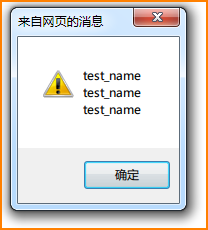
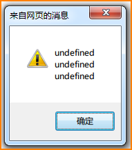

## iframe 中使用 window.name

### 一、问题

最近，使用iframe时遇到一个很奇怪的问题：`a.jsp`内嵌一个iframe页`b.jsp`,而`b.jsp`页面在js中定义了一个var name;没有进行赋值前，就有了初始值，找不到初始化的地方。

### 二、查资料
发现，a页面通过iframe方式嵌入b页面时，b页面可以通过window.name的方式获取b页面对应的iframe的name的值。

即a页面中  `<iframe name="ggg" src="b.jsp"/>`
则b中  `window.name = "ggg"`

#### 1. 示例代码1

##### a.jsp    
```html
<h3>aaa</h3>
<iframe id="iframeId" name="test_name" src="<%=request.getContextPath()%>/jsp/001/b.jsp">
    <p>Your browser does not support iframes.</p>
</iframe>
```

##### b.jsp
```html
<body>
 <h3>bbb</h3>
</body>
<script type="text/javascript">
var a = window.name;
var b = name;
//var name;
var c = name;

alert(a+"\r"+b+"\r"+c);
</script>
```

#### 2. 运行结果：
chrome（47）  

ie (ie8)


#### 3.示例代码2:
将`b.jsp`中的注释`var name`去掉，即
```html
<script type="text/javascript">

var a = window.name;
var b = name;
var name; //**这里重新定义**
var c = name;

alert(a+"\r"+b+"\r"+c);

</script>
```

#### 4. 此时结果为：
chrome（47）  

ie (ie8)


### 三、总结
1. 使用iframe方式内嵌子页面，子页面可以通过 `window.name` 的方式获取`iframe`的`name`的值;
   **前提：在子页面没有重新定义`name`时，ie和chrome下都可以直接用`name`进行获取。**
2. 但是，一旦在子页面定义了name变量
  - ie中，会导致`name`重新定义，初始化为`undefined`
  - chrome中，会导致`name`被赋值为`window.name`，即出现莫名其妙被初始化了。
