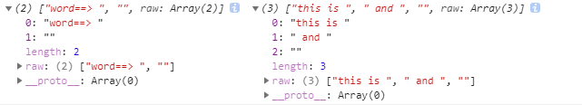

## 书籍链接
http://es6.ruanyifeng.com


## 变量的解析赋值
```ts
let {length:len} = "1234"
len  //4
typeof len  //"number"
```

```ts
let {toString:xx} = 123
typeof xx  //"function"
xx === Number.prototype.toString  //true
```

> 我的理解是：解析赋值适用于属性,不适用方法;上面的String.length是属性,而String.prototype.toString()是方法.

## [字符串扩展-标签模板](http://es6.ruanyifeng.com/#docs/string#%E6%A0%87%E7%AD%BE%E6%A8%A1%E6%9D%BF)

#### -基本效果：字符串 和 参数 分隔开
```ts
let who = "dave";
test`hello there ${who}`
test(['hello there ', ''], 'dave')

function test(_word, ..._params) {
  console.log(`word==> ${_word}`)
  console.log(`params==> ${_params}`)
}

//word==> hello there ,
//params==> dave

//word==> hello there ,
//params==> dave
```
> 上面两个输出效果一样，可以对比理解下模板标签的作用

#### -例2
```ts
let aa = "hello";
let bb = "world";
test`this is ${aa} and ${bb}`;

function test(_word, ..._params) {
console.log(`word==> ${_word}`)
console.log(`params==> ${_params}`)
console.log`word==> ${_word}`

//word==> this is , and ,
//params==> hello,world
//(2) ["word==> ", "", raw: Array(2)]0: "word==> "1: ""length: 2raw: (2) ["word==> ", ""]__proto__: Array(0) (3) ["this is ", " and ", "", raw: Array(3)]
```


> 个人理解,除非你需要把模板字符串本身和它的参数分开处理，否则没必要这样用,它不等价于直接用
