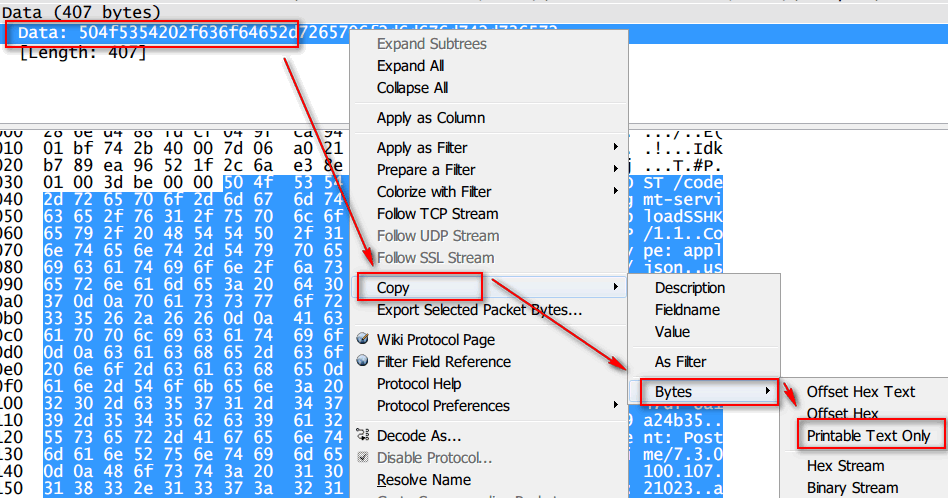

## 1、wireshark中的SYN ACK是啥意思?
#### :)理解
TCP协议中，TCP首部有6个标志位(0或1)
- SYN同步序号，用于建立连接，比如三次握手这种的;
- ACK表示响应是生效的(1就是有用,0就是没用),当ACK生效时,有个Acknowledment Number是为了响应上一次收到请求的Sequence Number的,为了实现请求响应的有序

#### :)参考

[TCP三次握手](https://github.com/jawil/blog/issues/14)

## 2、wireshark怎么看传输的数据的内容呢?
#### :)理解

i. 排除SYN这种三次握手的连接,会有一些[PSH,ACK]这种连接,选中其中一个,会发现下方有一个`Data`内容  
ii 选中`Data`部分 -> `Copy` -> `Bytes` -> `Printable Text Only`

#### :)参考
[学习Wireshark之二：数据包分析](http://blog.51cto.com/skypegnu1/1540728)
