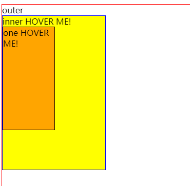

hover顾名思义，就是移上去的效果

## xxx:hover 和 xxx :hover的区别

### a)样例
[=> 在线演示](https://jsfiddle.net/GenweiWu/arxbw6md/)

> inner的hover效果是黄色，one的hover效果是橘色  

### b)说明
`xxx:hover` 表示当xxx出现hover事件
`xxx :hover` 则表示xxx的子元素出现hover事件
